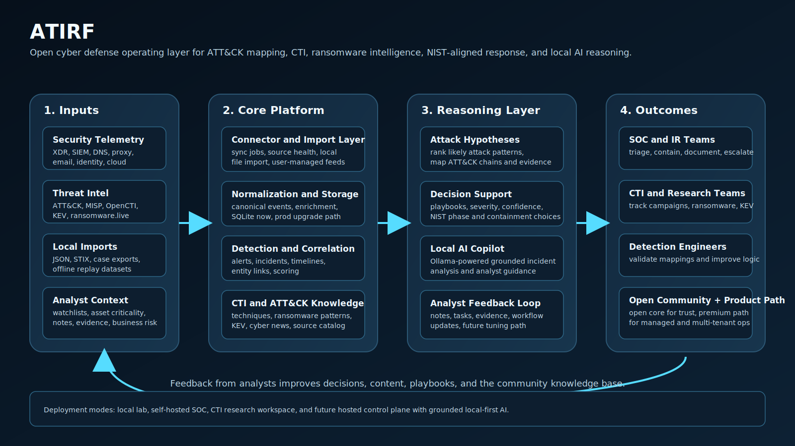
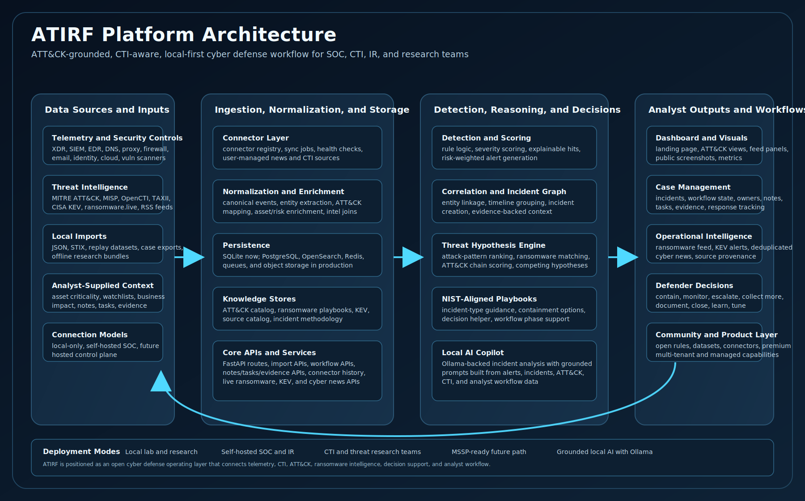

# ATIRF (Adaptive Threat Intelligence & Response Framework)


> Open cyber defense platform for detection engineering, threat intelligence, incident reasoning, and guided response.  
> Built for defenders, researchers, and the global security community.
> Designed to be transparent, practical, and community-driven.

Created and maintained by **Mr. Gr33k H4sh3r / Th3Gr33k - AKA Deiker**.  
A Cybersecurity lead that love cyber and AI :)



---

## 🚧 Project Status - Work in Progress / Experimental

ATIRF is currently a **work in progress** and should be considered **experimental**.

This platform is under active development as I continue refining:

- Detection logic and correlation capabilities  
- Threat intelligence enrichment workflows  
- AI-assisted triage and explainability  
- System architecture and integrations  

The goal is to build something **practical, modular, and meaningful for cyber defenders worldwide**.

> I would genuinely appreciate feedback, ideas, contributions, and support from the cybersecurity and AI community.

---
## Why ATIRF Exists

Cybersecurity is shifting from tool-centric detection to **intelligence-driven decision making**.

Defenders today face:
- Alert fatigue
- Fragmented telemetry
- Limited context during triage
- Increasingly intelligent adversaries

ATIRF is being built to solve that by combining:
- detection engineering
- threat intelligence enrichment
- MITRE ATT&CK mapping
- incident correlation
- grounded AI assistance

Into a **single analyst-centric workflow**.

The purpose is not to replace analysts.
The purpose is to help cyber defenders:

- move faster with evidence
- understand attack chains instead of isolated alerts
- operationalize CTI in day-to-day defense
- share detections and improvements openly
- build a stronger community-owned security platform together

ATIRF is not positioned as the only project in cyber defense doing CTI, ATT&CK, or incident response.
Its differentiation is in bringing those capabilities together into a single open workflow that is:

- ATT&CK-grounded
- CTI-aware
- ransomware-aware
- NIST-aligned
- local-AI-capable through Ollama
- designed for community contribution

---

## 🎯 What is ATIRF?

ATIRF (Adaptive Threat Intelligence & Response Framework) is a **modular cyber defense platform** designed to:

- Ingest multi-source telemetry  
- Enrich events with threat intelligence  
- Detect suspicious behavior  
- Correlate events into incidents  
- Produce **explainable, analyst-ready outputs**  

This is not just a concept—this repository includes a **working demo system**.

The long-term goal is to make ATIRF useful for:

- SOC analysts
- threat hunters
- detection engineers
- incident responders
- purple teams
- cyber research communities
- universities and labs
- MSSPs and smaller defender teams that need a portable stack

---

## ⚙️ Current Implementation

This repository includes a **functional demo platform** built with:

- **FastAPI** backend  
- **SQLite** (via SQLAlchemy) for portability  
- **Static HTML/JavaScript dashboard**  
- **Rule-based detection engine**  
- **Explainable AI-style summarization (deterministic)**  
- **Docker Compose deployment**  
- **Sample telemetry datasets**

---

## 🧠 Key Features

- Multi-source telemetry ingestion  
- Threat intelligence enrichment  
- MITRE ATT&CK mapping  
- AI-assisted incident analysis (explainable)  
- Risk scoring and event correlation  
- Analyst-centric case workflow  
- Portable demo environment  

## How Defenders Can Use It

Cyber defenders should be able to use ATIRF to:

- ingest telemetry from endpoints, email, identity, DNS, proxy, and firewall tools
- enrich events with CTI from ATT&CK, KEV, MISP, OpenCTI, ransomware tracking, and other feeds
- correlate activity into incidents with evidence and rationale
- rank likely attack patterns and ransomware playbooks from observed ATT&CK techniques
- generate grounded analyst summaries and recommended investigation steps
- test detections locally with public datasets before deploying at scale
- contribute improved detections, mappings, connectors, datasets, and investigation workflows

## Real Usage Modes

ATIRF is designed to support multiple practical modes:

- `Local lab mode`: import JSON datasets or replay telemetry locally and analyze everything on one machine
- `Self-hosted SOC mode`: connect internal tools such as XDR, SIEM, identity, CTI, DNS, email, and firewall sources
- `CTI operations mode`: enrich incidents with ATT&CK, KEV, ransomware tracking, and external intelligence

For teams starting small, the easiest path is:

1. run the platform locally
2. import JSON telemetry exports
3. seed ATT&CK and CTI
4. review incidents, playbooks, decision support, and local AI output

Then grow into:

- connector-driven ingestion
- self-hosted internal deployment
- future multi-user and hosted operational models

## Community Contribution Model

ATIRF should be built in the open.
The intent is to make this a platform defenders can improve together.

Ways to contribute:

- detection rules and ATT&CK mappings
- sample telemetry and replay datasets
- connector integrations for CTI and telemetry sources
- ransomware group playbooks and campaign tracking
- UI improvements for analysts and researchers
- testing, bug reports, and validation of false positives
- documentation, deployment guides, and hardening advice

If the community helps shape the core, the result can become a serious open cyber defense platform rather than another closed tool with no trust layer.

---

## 🏗️ Architecture



---

## 🎥 Demo Capabilities

- Load realistic sample telemetry  
- Observe detection and alert generation  
- View correlated incidents  
- Analyze explainable AI-style summaries  
- Explore ATT&CK mappings and risk scoring  

---

## 🚀 Quick Start

```bash
docker compose up --build
```

Or for local development:

```bash
cd backend
python -m venv .venv
source .venv/bin/activate
pip install -r requirements.txt
python -m uvicorn app.main:app --reload
```

Then open:

* Dashboard → [http://127.0.0.1:8000/](http://127.0.0.1:8000/)
* API Docs → [http://127.0.0.1:8000/docs](http://127.0.0.1:8000/docs)

For screenshots and a fuller demo narrative:

* `Load Demo Data` → compact attack chain
* `Load Showcase Data` → richer multi-incident dataset
* `Seed ATT&CK + CTI` → loads ATT&CK techniques, CTI source catalog, and ransomware playbook matching

To validate locally:

```bash
cd backend
pytest -q
```

---

## 🎯 Goals

* Provide an **analyst-centric detection and triage workflow**
* Demonstrate **explainable AI assistance** without replacing humans
* Deliver a **practical, portable blueprint** for defenders
* Enable future integrations with:

  * EDR/XDR
  * SIEM platforms
  * Firewalls
  * Email security
  * Threat intelligence platforms

## Product Direction

ATIRF should evolve as:

- an open-source detection and incident reasoning platform
- a premium hosted or enterprise operational layer for SOCs and MSSPs
- a connector-driven CTI and attack-pattern analysis platform with grounded AI assistance
- a local-first AI workflow powered by open models through Ollama where possible

## What Makes ATIRF Distinct

ATIRF should be presented as a distinct combination of:

- ATT&CK-driven detection and incident mapping
- integrated CTI source inventory and enrichment
- ransomware playbook reasoning plus optional live ransomware tracking
- CISA KEV awareness and cyber-news situational context
- incident-type playbooks and interactive decision support
- grounded local AI for incident analysis using open models through Ollama

That is the strength of the platform.
The claim should be that ATIRF brings these layers together into one open defender workflow, not that no adjacent platform exists.

See:

- `docs/product-blueprint.md`
- `docs/production-roadmap.md`

## New Platform Building Blocks

- ATT&CK technique catalog seeded from `data/attack/mitre_attack_seed.json`
- CTI source catalog seeded from `data/intel/source_catalog.json`
- ransomware family playbook patterns in `data/intel/ransomware_patterns.json`
- live CISA KEV ingestion and exposure context
- live cybersecurity news aggregation for defender awareness
- user-defined connectors for MISP, TAXII, OpenCTI, ransomware tracking, and optional OSINT sources
- ranked attack-pattern hypotheses based on observed ATT&CK technique overlap
- incident-type response playbooks and interactive decision-support helper
- persistent case workflow fields for owner, phase, disposition, and response summary
- local connector sync status
- connector job history for local worker-style execution visibility
- local JSON event import for simplified adoption
- saved analyst notes, tasks, and evidence records on incidents
- user-managed cyber news feed sources with trust labels and aggregation
- future grounded local-AI copilot path via Ollama-hosted open models
- optional live ransomware tracking through the `ransomware.live` API

## Local Open AI Direction

The preferred AI direction for ATIRF is:

- local-first where possible
- open-source models
- grounded on evidence from the platform
- optional, not mandatory

The first practical path is to use **Ollama** to run open models locally for:

1. incident summarization
2. ATT&CK and attack-pattern hypothesis explanation
3. defender guidance and next-step recommendations

That keeps the AI layer affordable, portable, and compatible with labs, research environments, and defenders who do not want to send sensitive data to a closed external API.

## Ollama Setup

To enable the local copilot:

```bash
ollama serve
ollama pull llama3.1:8b
```

Then set:

```bash
ATIRF_OLLAMA_ENABLED=true
ATIRF_OLLAMA_HOST=http://127.0.0.1:11434
ATIRF_OLLAMA_MODEL=llama3.1:8b
```

After starting ATIRF, open an incident and click `Generate Incident Analysis` in the `Local AI Copilot` panel.

## Live Ransomware Feed

ATIRF now includes an optional live ransomware feed integration designed around the `ransomware.live` API.

To enable it:

```bash
ATIRF_RANSOMWARE_LIVE_ENABLED=true
ATIRF_RANSOMWARE_LIVE_BASE_URL=https://api.ransomware.live/v2
```

With that enabled, the dashboard can show:

- recent claimed victims
- recent active groups
- live ransomware feed status
- local ATT&CK-based ransomware playbook matching alongside live feed context

Important:

- treat public victim-claim feeds as enrichment, not ground truth
- review `ransomware.live` terms and usage boundaries before commercial use
- keep the platform evidence-first even when public leak-site tracking is enabled

## CISA KEV and Cyber News

ATIRF now also supports:

- live CISA KEV ingestion for exploited-vulnerability awareness
- cybersecurity news aggregation for defender situational awareness across multiple public feeds

These panels are designed as enrichment layers for analysts and researchers, not as automatic detection truth.

---

## 🔍 Demo Scenario

The included dataset simulates a realistic attack chain:

1. Microsoft Word spawns PowerShell
2. PowerShell executes an encoded command
3. Endpoint connects to a newly observed domain
4. Domain has poor reputation
5. Risk score increases based on behavior + context
6. Events are correlated into a single incident
7. System generates an **explainable analyst summary + recommended actions**

---

## 📦 Repository Structure

```text
atirf-platform/
├── backend/
│   ├── app/
│   │   ├── api/
│   │   ├── models/
│   │   ├── services/
│   │   ├── static/
│   │   ├── database.py
│   │   ├── main.py
│   │   └── schemas.py
│   ├── tests/
│   └── requirements.txt
├── data/
│   └── sample_logs/
├── docs/
├── docker/
├── scripts/
├── docker-compose.yml
└── README.md
```

---

## 📡 API Overview

* `GET /api/health` → Health check
* `POST /api/events/ingest` → Ingest event
* `POST /api/events/bulk` → Bulk ingest
* `GET /api/events` → List events
* `GET /api/alerts` → Alerts
* `GET /api/incidents` → Correlated incidents
* `GET /api/metrics` → Metrics
* `POST /api/demo/load` → Load demo dataset

---

## 📊 Risk Scoring Model

Transparent and explainable:

```text
Risk Score = Base Severity + Asset Criticality + IOC Reputation + Behavioral Indicators + Novelty
```

Designed to be:

* understandable
* tunable
* extensible

---

## 🛡️ Detection Logic (Current)

* Encoded PowerShell execution
* Office spawning script engines
* Suspicious domain communication
* Admin activity on critical assets
* Multi-event correlation (attack chain detection)

---

## 🤖 AI / Explainability Layer

This demo intentionally avoids external LLM dependency.

Instead, it provides:

* Deterministic, explainable incident summaries
* Analyst-readable reasoning
* Transparent logic

Future roadmap includes:

* LLM-assisted triage
* Retrieval-augmented analysis
* Natural language querying
* Threat narrative generation

---

## 🔐 Security Considerations

This is a **demo blueprint**. For production use, implement:

* RBAC and SSO
* API authentication/authorization
* Secrets management
* Queue-based processing
* Secure logging
* LLM safety controls (prompt injection, output validation)

---

## 🌍 Intended Audience

* SOC Analysts
* Security Engineers
* Threat Intelligence Teams
* AI Security Practitioners
* MSSPs
* Blue Teams
* Cybersecurity Researchers

---

## 👤 Author

**Mr. Gr33k H4sh3r - AKA Deiker**
A Cybersecurity lead that love cyber and AI :)

---

## 🤝 Contributing / Community 

This project is being built **in the open**.

If you're in:

* blue team
* threat intel
* AI security
* detection engineering

Your feedback matters.

> Suggestions, ideas, critiques, and contributions are all welcome.

---

## ⭐ Vision

> Build a practical, explainable, and globally accessible platform that helps defenders make better decisions—not just detect more alerts.
 
 ---
